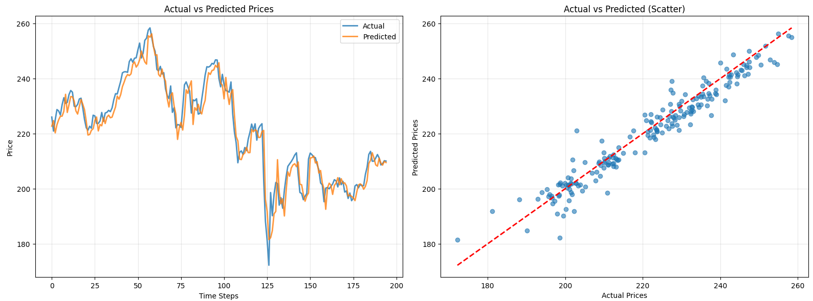

# **📈 Stock Price Prediction with News Sentiment**


A deep learning project predicting Apple’s stock prices by combining historical stock data with sentiment analysis of real-world news headlines. Built using **TensorFlow/Keras**, Hugging Face Transformers, and **GRU neural networks**.

---

## **🔍 Overview**
- Objective: Predict future Apple Inc. (AAPL) stock prices using historical price data + news sentiment.
- Stock Data Source: Yahoo Finance
- News Source: New York Times (Apple-related headlines)
- **Sentiment Model:** siebert/sentiment-roberta-large-english
- **ML Models:** LSTM (baseline) and GRU (current best)
- Trained a GRU neural network that improved R² by 10% over LSTM baseline and reduced RMSE by ~34% on AAPL stock predictions.

---

## **🧠 Project Workflow**
1. **Collect Stock Data:** Downloaded AAPL historical prices from Yahoo Finance.  
2. **Collect News Headlines:** Scraped or queried Apple-related headlines from the NYT.  
3. **Sentiment Analysis:**  
   - Used pre-trained Roberta to classify headlines (positive/neutral/negative).  
   - Aggregated daily sentiment scores.  
4. **Feature Engineering:**  
   - Combined sentiment scores with stock features (Close, Volume, etc.).  
   - Scaled features using MinMaxScaler.  
5. **Model Training:**  
   - Trained both **LSTM** and **GRU** models on sequences of combined price + sentiment data.  
   - GRU outperforms LSTM across all evaluation metrics.  

---

## **📊 Model Comparison: LSTM vs GRU**

| Metric   | LSTM Test | GRU Test | Better? |
|----------|-----------|----------|---------|
| RMSE     | 6.88      | 4.53     | ✅ GRU |
| MAE      | 5.48      | 3.50     | ✅ GRU |
| R²       | 0.8471    | 0.9338   | ✅ GRU |
| MAPE     | 2.51%     | 1.60%    | ✅ GRU |

> ⚡ The GRU model consistently outperforms the LSTM baseline in all key metrics while both models capture the overall trend well.

## **🧠 Model Architectures & Comparison**

I experimented with **LSTM** and **GRU** models to predict Apple stock prices from historical data + news sentiment. The **GRU model outperforms** the LSTM baseline.

---

### **GRU Model (Current Best)**



```python
def build_gru_model(hp):
    model = keras.Sequential([
        Input(shape=(X_train.shape[1], X_train.shape[2])),
        GRU(units=hp.Int("gru_units_1", 32, 128, step=32),
            return_sequences=hp.Boolean("return_seq_1", default=False)),
        GRU(units=hp.Int("gru_units_2", 32, 128, step=32),
            return_sequences=False) if hp.Boolean("add_second_gru") and hp.get("return_seq_1") else keras.layers.Layer(),
        Dropout(rate=hp.Float("dropout", 0.1, 0.4, step=0.1)),
        Dense(units=hp.Int("dense_units", 16, 64, step=16), activation="relu",
              kernel_regularizer=keras.regularizers.l2(hp.Choice("l2_reg", [1e-4,1e-3,1e-2]))),
        Dense(1)
    ])
    model.compile(optimizer=keras.optimizers.Adam(
                      learning_rate=hp.Float("lr", 1e-4, 1e-2, sampling="log")),
                  loss="mse",
                  metrics=[keras.metrics.RootMeanSquaredError(), "mae"])
    return model
```

- Input Layer: Takes sequences of historical stock and sentiment features
- GRU Layer 1: Tunable units (32–128) to capture sequential dependencies
- GRU Layer 2 (optional): Additional GRU layer if first layer returns sequences
- Dropout Layer: Tunable rate (10–40%) for regularization
- Dense Layer: Tunable units (16–64) with ReLU activation and L2 regularization
- Output Layer: Single neuron predicting the next stock price
- Loss Function: Mean Squared Error (MSE)
- Optimizer: Adam with tunable learning rate (1e-4 to 1e-2)

#### **GRU Performance**
| Metric   | Train  | Validation | Test   |
| -------- | ------ | ---------- | ------ |
| RMSE     | 3.058756 | 3.739361 | 4.525846 |
| MAE      | 2.381221 | 2.798822 | 3.504356 |
| R² Score | 0.9705   | 0.9741   | 0.9338   |
| MAPE     | 1.51%    | 1.39%    | 1.60%    |

---

### **LSTM Model (Baseline)**


```python
model = Sequential([
    Input(shape=input_shape),
    LSTM(32, return_sequences=False),
    BatchNormalization(),
    Dense(16, activation='relu'),
    Dropout(0.3),
    Dense(1)
])
optimizer = Adam(learning_rate=0.0003)
model.compile(optimizer=optimizer, loss=Huber(delta=1.0))
```

- Input Layer: Takes sequences of historical stock and sentiment features
- LSTM Layer: 32 units to capture temporal dependencies
- BatchNormalization: Helps stabilize and accelerate training
- Dense Layer: 16 neurons with ReLU activation
- Dropout Layer: 30% dropout rate for regularization
- Output Layer: Single neuron predicting the next stock price
- Loss Function: Huber Loss (delta=1.0) — more robust to outliers than MSE
- Optimizer: Adam with a learning rate of 0.0003

#### **LSTM Model Performance**
| Metric   | Train  | Validation | Test   |
| -------- | ------ | ---------- | ------ |
| RMSE     | 4.950839 | 7.814772 | 6.879227 |
| MAE      | 3.990305 | 6.120816 | 5.484765 |
| R² Score | 0.9228   | 0.8870   | 0.8471   |
| MAPE     | 2.49%    | 2.98%    | 2.51%    |

---

## **🚀 Future Improvements**
- Improve directional accuracy via classification or hybrid models
- Experiment with other sentiment models (FinBERT, financial BERT variants)
- Add more features like RSI, MACD, and volume spikes
- Build an interactive dashboard to visualize predictions

## **⚖️ License**

This project is licensed under the [MIT License](LICENSE).
